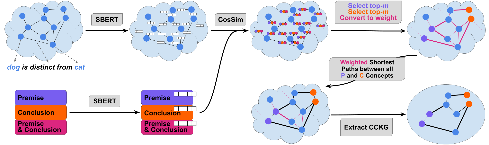
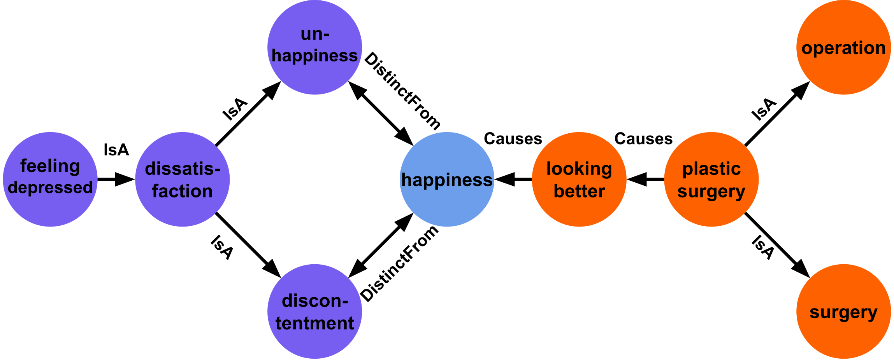

# Similarity-weighted Construction of Contextualized Commonsense Knowledge Graphs for Knowledge-intense Argumentation Tasks

This repository provides the code and resources to construct CCKGs as described in our paper [Similarity-weighted Construction of Contextualized Commonsense Knowledge Graphs for Knowledge-intense Argumentation Tasks](https://arxiv.org/abs/2305.08495). 

Please feel free to send us an email (<a href="mailto:plenz@cl.uni-heidelberg.de">plenz@cl.uni-heidelberg.de</a>) if you have any questions, comments or feedback. 


## Overview
We propose a method to construct **C**ontextualized **C**ommensense **K**nowledge **G**raphs (short: **CCKG**s). The CCKGs are extracted from a given knowledge graph, by constructing similarity-weighted shortest paths which increase contextualization. 

CCKGs can be used in various domains and tasks, essentially they can be used whenever text-conditioned subgraphs need to be extracted from a larger graph. However, we only evaluated our approach for Commonsense Knowledge Graphs and for Argumentative application. 

<p align="center">
  
</p>
<p align="center">
  
</p>


## 0. Dependencies
We tested the code with python version 3.8. The necessary packages are specified in `requirements.txt`.
If you use Conda, you can run the following commands to create a new environment:
```bash
conda create -y -n CCKG python=3.8
conda activate CCKG
pip install -r requirements.txt
```

## 1. Download Knowledge Graph
For ConceptNet and ExplaKnow you can [download the preprocessed knowledge graphs](https://www.cl.uni-heidelberg.de/~plenz/CCKG/knowledgegraph.tar.gz) by running 
```bash
wget https://www.cl.uni-heidelberg.de/~plenz/CCKG/knowledgegraph.tar.gz
mv knowledgegraph.tar.gz data/
tar -xvzf data/knowledgegraph.tar.gz
rm data/knowledgegraph.tar.gz
```

Please refer to section 7 if you want to use a different knowledge graph.  

## 2. Concept Extraction
You can extract concepts and save them to lookup dictionaries by running
```bash
bash_scripts/concept_extractions.sh
```
In the script you can adjust the setting, e.g. what task, datasplit and / or knowledge graph you want to use. This script yields dictionaries with lookups of what concepts belong to which sentences. The keys of the dictionaries are the lower-cased sentences. 

Afterwards you have to run 
```bash
python python_scripts/combine_lookup_dicts.py
```
to combine the lookups from different datasplits to one lookup. Note that you might have to adjust the arguments in `python_scripts/combine_lookup_dicts.py`. 

## 3. Shortest Paths
Note that if you want to test different settings of CCKGs, then you do not have to compute the shortest paths for all of them individually. For example, if you want to experiment with different values of $k$ and $m$, then you only need to compute the shortests paths once for the largest values of $k$ and $m$. Other settings will be a subset of the computed shortest paths, so we reuse these computations. All you have to do is specify the correct files in later steps when pruning (section 4) or loading (section 5) the CCKGs. 

We first compute the shortest paths and save them in a jsonl-dictionary format. You can compute the shortest paths with
```bash
bash_scripts/compute_shortest_paths.sh
```
Note that this script only marginally improves from GPUs, so it can be run in CPUs. If you have multiple CPU cores available, then you can process different parts of your data by setting `start_index` and `end_index`. Afterwards you need to combine the files to one file (while maintaining the order of lines). This can be done for example by
```bash
cat fn_index{?,??,???,????,?????}.jsonl > fn.jsonl
```
where `fn` needs to be replaced by the correct file name. In case you compute all shortest paths in one go (i.e. without creating multiple files) we still advise to rename the file to not include `index`. 

## 4. Pruning of CCKGs
You can prune the graphs by running
```bash
bash_scripts/prune_graphs.sh
```
Note that in the script you have to provide the path to the shortest path dict computed in Step 3, as well as several parameters that you already used to compute the shortest path dict in step 3, for example the number of shortest paths $k$. This is, because as described above you can compute the shortest path dict once for a large $k$ and then use smaller values of $k$ later. Similar to $k$, the lookup does not have to match the lookup from step 3, as long as the lookup used in step 4 is a subset of the lookup used in step 3. 

Also, same as in step 3 you can prune graphs in parallel by giving a start_index and hence, you need to combine / rename the output file accordingly. 

## 5. Loading (pruned) CCKG
An example script to load CCKGs to iGraph is provided in `bash_scripts/load_graphs.sh` and `load_shortest_path_dict.py`. 

## 6. Constructing CCKGs for different tasks
To construct CCKGs on different data you need to implement your own datahandler and include it in the argparse for the datahandler. A template is provided at the end of `methods/data_handler.py`. Parts that need to be changed are marked with `# TDND` which stands for `# ToDo New Data`. You need to implement `__init__` to define relevant paths, `load_raw_data` which loads the data from the disk to the RAM as a list and `get_premise_and_conclusion` which returns the premise and the conclusion given the index of the data instance. How to deal with (non-argumentative) data where you do not have a premise and a conclusion is described in the comments. Finally you need to add your new datahandler to `str_to_datahandler`. 

Afterwards, you can just pass your new datahandler in steps 2-5. 

## 7. Constructing CCKGs for different Knowledge Graphs
To construct CCKGs from a different knowledge graph you need to first create the knowledge graph and then pass it in the datahandler(s). 

The knowledge graph has to be saved as a directed igraph. Multiple edges between two concepts should be only one edge in the graph. 
The graph has the following features:
- graph feature `sBERT_uri` (*): uri of the SBERT model that was used
- node feature `name`: name of the concept
- node feature `embedding` (*): SBERT embedding of the concept (not always necessary)
- edge feature `relation`: List of all relations between the two concepts
- edge feature `nl_relation` (*): List of the verbalizations of the triplets
- edge feature `embedding` (*): List of the SBERT embeddings of the triplets

Features marked by (*) can be added with the code `add_embedding_to_knowledgegraph.py`. Make sure that the embeddings have a L2 norm of 1, and normalize them if necessary. 

Please refer to the provided knowledge graphs for an example. 

## 8. Citation
Please consider citing our paper if it, or this repository was beneficial for your work:

```
@inproceedings{plenz-etal-2023-similarity,
    title = "Similarity-weighted Construction of Contextualized Commonsense Knowledge Graphs for Knowledge-intense Argumentation Tasks",
    author = "Plenz, Moritz  and
      Opitz, Juri  and
      Heinisch, Philipp  and
      Cimiano, Philipp  and 
      Frank, Anette",
    booktitle = "Proceedings of the 61th Annual Meeting of the Association for Computational Linguistics",
    year = "2023",
    address = "Toronto, Canada",
    publisher = "Association for Computational Linguistics",
}
```